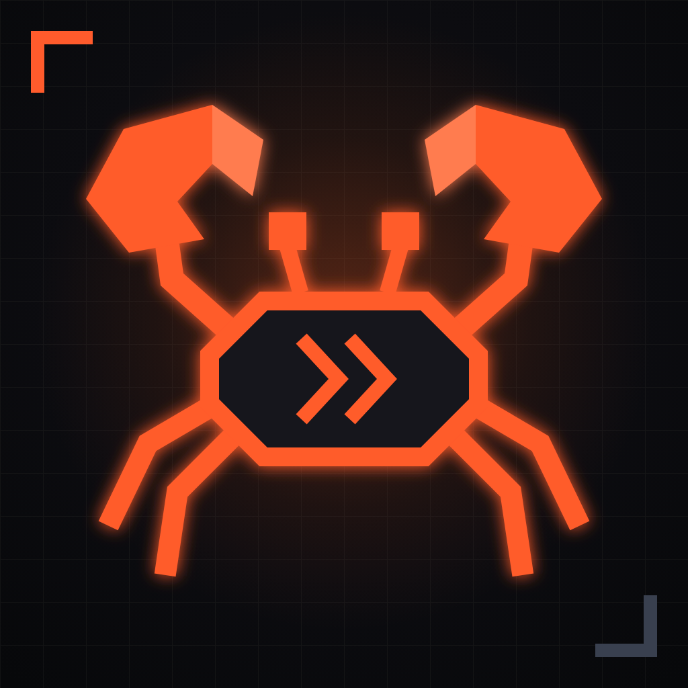

# crabgent

<p align="center">
  
</p>

crabgent is a Rust framework for building LLM agents. The same kernel drives
a single-purpose bot with one tool and no memory, and a multi-channel
assistant with persistent memory, scheduled jobs, voice, and background
tasks. You pick the crates you need; everything else stays out of your
binary.

This package ships two things, as source only:

```text
crabgent/   the framework: ~40 focused library crates
app/        a complete reference app built on top of it
scripts/    build helper
data/       local runtime data, empty by default
```

The app uses path dependencies pointing at `../crabgent`, so the package
builds without any separate checkout.

## The framework

At the core sits a small, provider-agnostic agentic loop:

```text
            ┌────────────────────── Kernel ──────────────────────┐
 inbound →  │  turn loop: prompt → LLM → tool calls → LLM → ...  │ → outbound
 (channel)  │                                                    │  (channel)
            │   Provider      Hook chain        Tools            │
            │   openai        FIFO, observe +   memory, cron,    │
            │   anthropic     transform every   calendar, tasks, │
            │   google        step              tts, search, ... │
            │                                                    │
            │   PolicyHook: every action is typed and gated      │
            └───────────────────────┬────────────────────────────┘
                                    │ Store traits
                          SQLite / Postgres / in-memory
```

The pieces that make this composable:

* **Kernel** (`crabgent-core`): the turn loop. Carries no logging, no
  storage, no channel knowledge. Built with
  `Kernel::builder().provider(...).policy(...).add_tool(...).add_hook(...)`.
* **Providers**: OpenAI (API key or ChatGPT OAuth), Anthropic, Google
  Gemini, ElevenLabs for audio. One trait, swappable per agent and per
  call.
* **Hooks**: a FIFO chain that observes and transforms every kernel step.
  Session persistence, semantic compaction, goal steering, prosody tags,
  message injection, logging — all hooks, all optional. The core crate has
  no tracing dependency; observability itself flows through the chain.
* **Tools**: one trait, many small crates. Memory CRUD, cron CRUD, task
  spawning, calendar math, session full-text search, text-to-speech,
  tool-output caching. Your own tools are the same trait.
* **Policy**: every tool call and store mutation is a typed `Action`
  checked by a `PolicyHook`. Pairing, allowlists, and per-scope rules live
  in one place.
* **Stores**: trait surfaces for sessions, memory, tasks, cron jobs, and
  tool cache, with SQLite, Postgres, and in-memory backends.
* **Channels**: Matrix, Telegram, and Slack adapters behind one `Channel`
  trait; the reference app adds a TUI WebSocket and a web voice console on
  the same surface.

A narrow agent is a few lines (sketch, see `crabgent-examples` for runnable
code):

```rust
let kernel = Kernel::builder()
    .provider(openai_provider)
    .policy(allow_all)
    .add_tool(MyOneTool::new())
    .build();
let outcome = kernel.run(request).await?;
```

A capable assistant is the same builder with more crates plugged in:
session persistence, memory with relations and embeddings, consolidation,
background tasks, cron, voice in and out, MCP in both directions. The
reference app under `app/` is exactly that build-out.

## Crate map

| Area | Crates |
| --- | --- |
| Core | `crabgent-core` (kernel, hooks, tools, policy, actions), `crabgent-log` |
| Providers | `provider-openai`, `provider-anthropic`, `provider-google`, `provider-elevenlabs`, `provider-transport` |
| Channels | `channel` (traits), `channel-matrix`, `channel-telegram`, `channel-slack` |
| Storage | `store` (traits + in-memory), `store-sqlite`, `store-postgres`, `session` |
| Memory | `memory` (classes, recall scoring), `memory-consolidation`, `embedding-fastembed` |
| Tools | `tool-memory`, `tool-cron`, `tool-task`, `tool-calendar`, `tool-session`, `tool-tts`, `tool-audio`, `tool-cache`, `tool-compact`, `tool-goal`, `tool-models`, `tool-consolidation` |
| Hooks | `hook-log`, `hook-compact`, `hook-goal`, `hook-inject`, `hook-subprocess`, `hook-divergence`, `prosody`, `thinking` |
| Commands | `command` (slash-command dispatch), `command-compact`, `command-goal`, `command-model` |
| Scheduling | `cron` (claim-based, multi-worker safe), `task` (background kernel runs) |
| Integration | `mcp-client`, `mcp-server`, `calendar`, `test-support`, `examples` |

Every capability is an ordinary crate. Leave out what you do not need and
it never touches your build.

## The reference app (`app/`)

`app/` is a complete, opinionated deployment of the framework, and it is
meant as a worked example: copy it, rename it, delete what you do not
need, and grow your own agent from there. The framework is designed for
exactly that kind of fork-and-own use; nothing in `app/` is privileged.

What it wires up:

* one tokio process driving N agents, each with its own kernel, hook
  chain, prompt, and model config, sharing one SQLite store
* channels per agent: terminal UI over WebSocket, Matrix, Telegram, and a
  browser voice console (server STT, TTS with barge-in)
* a web admin at `/admin`: memory browser and editor, memory relations
  graph, cron manager, session search with full transcripts, voice console
* an MCP server per agent (`POST /mcp/<agent>`) so other tools can talk to
  your agents, and an MCP client so your agents can call external servers
* background tasks with completion notifications, cron jobs with
  per-scope ownership, goal tracking, memory consolidation

Typical requests once it runs:

```text
Create a new session named "project-planning".
Remember that the launch checklist lives in this session.
Search your memory for everything about the onboarding project.
Start a background task: read these notes and list open questions.
Compare these two options and tell me what you would do.
```

## Requirements

Install Rust. The repo pins the expected toolchain through
`crabgent/rust-toolchain.toml`; rustup will download it when needed.

On macOS, install the Xcode command line tools:

```sh
xcode-select --install
```

On Linux, install a normal build toolchain, `pkg-config`, and OpenSSL
development headers if your distribution needs them for native dependencies.

## Build

From the package root:

```sh
make build
```

This builds `target/release/crabgent`.

On macOS the helper script applies local ad-hoc codesigning only. It does not
use Developer ID signing and does not notarize. On Linux it just builds.

Manual build:

```sh
cd app
CARGO_TARGET_DIR=../target cargo build --release --bin crabgent
```

## First Run

Create a local config and data directory:

```sh
cp config.toml.example config.toml
mkdir -p data
```

Login with OpenAI OAuth:

```sh
make login
```

Start the runtime:

```sh
make run
```

In another terminal, start the TUI:

```sh
make tui
```

Open the dashboard while the runtime is running:

```text
http://127.0.0.1:3100/admin
```

The dashboard token is `[web].auth_token` in `config.toml`. Change it before
using the dashboard beyond localhost.

## Configuration

The example config starts one local agent named `local`.

Keep these files private:

```text
config.toml
data/
target/
```

Use `config.toml.example` as the shared template. Do not put API keys, OAuth
tokens, chat tokens, or private paths into shared files.

## Useful Commands

```sh
make check
make build
make login
make run
make tui
./target/release/crabgent --help
```

## License

Dual-licensed under MIT or Apache-2.0, at your option. See
`crabgent/LICENSE-MIT` and `crabgent/LICENSE-APACHE`.
